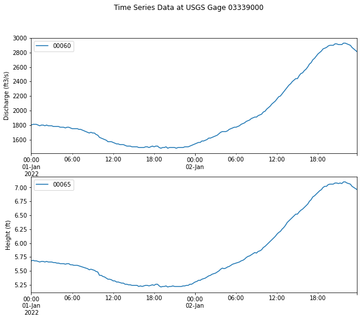

nwis package provides a set of functions that allows downloading of the `National Water Information System
(NWIS) <https://waterdata.usgs.gov/nwis?>`_ for data analysis and visualization.

nwis package includes a `Basic Model Interface (BMI) <https://bmi.readthedocs.io/en/latest/>`_,
which converts the NWIS dataset into a reusable, plug-and-play data component for
`Community Surface Dynamics Modeling System (CSDMS) <https://csdms.colorado.edu/wiki/Main_Page>`_ modeling framework.

Getting Started
===============

Installation
++++++++++++

**Stable Release**

The nwis package and its dependencies can be installed with pip.

.. code-block:: console

    $ pip install nwis

**From Source**

After downloading the `source code <https://github.com/gantian127/nwis>`_, run the following command from top-level
folder (the one that contains setup.py) to install nwis.

.. code-block:: console

    $ pip install -e .

Download NWIS Data
+++++++++++++++++++++

You can launch binder to test and run the code below. |binder|

**Example 1**: use Nwis class to download data (Recommended method)

.. code-block:: python

   import matplotlib.pyplot as plt
   from nwis import Nwis

   # get data from NWIS
   nwis_data = Nwis()
   dataset = nwis_data.get_data(site='03339000', start_date='2020-01-01', end_date='2020-01-15', data_type='dv')

   # show site metadata
   dataset.attrs

   # show variable metadata
   for var_name in dataset.data_vars:
       print(dataset[var_name].attrs)

   # plot discharge data
   dataset['00060'].plot(figsize=(12,7))
   plt.ylabel('{} ({})'.format(dataset['00060'].variable_name,dataset['00060'].variable_unit))
   plt.title('Discharge Observation at USGS Gage 03339000')

|ts_plot|

**Example 2**: use BmiNwis class to download data (Demonstration of how to use BMI).

.. code-block:: python

   import matplotlib.pyplot as plt
   import numpy as np
   import cftime

   from nwis import BmiNwis

   # initiate a data component
   data_comp = BmiNwis()
   data_comp.initialize('config_file.yaml')

   # get variable info
   for var_name in data_comp.get_output_var_names():
       var_unit = data_comp.get_var_units(var_name)
       print(' variable_name: {}\n var_unit: {}\n'.format(var_name, var_unit))

   # get time info
   start_time = data_comp.get_start_time()
   end_time = data_comp.get_end_time()
   time_step = data_comp.get_time_step()
   time_unit = data_comp.get_time_units()
   time_steps = int((end_time - start_time)/time_step) + 1
   print(' start_time:{}\n end_time:{}\n time_step:{}\n time_unit:{}\n time_steps:{}\n'.format(start_time, end_time, time_step, time_unit, time_steps))

   # initiate numpy arrays to store discharge data
   discharge_value = np.empty(1)
   discharge_array = np.empty(time_steps)
   cftime_array = np.empty(time_steps)

   for i in range(0, time_steps):
       data_comp.get_value('discharge', discharge_value)
       discharge_array[i] = discharge_value
       cftime_array[i] = data_comp.get_current_time()
       data_comp.update()

   time_array = cftime.num2date(cftime_array, time_unit, only_use_cftime_datetimes=False, only_use_python_datetimes=True)

   # plot discharge data
   plt.figure(figsize=(9,5))
   plt.plot(time_array, discharge_array)
   plt.ylabel('{} ({})'.format('discharge', 'cubic feet per second'))
   plt.title('Discharge Observation at USGS Gage 03339000')

Parameter settings
+++++++++++++++++++
"get_data()" method includes multiple parameters for NWIS data download. Details for each parameter are listed below.

* **site**: The site number for the USGS gages. It has a unique 8- to 15-digit identification number.

* **start_date**: The start date of the time series data. A string of the form "YYYY-MM-DD".

* **end_date**: The end date of of the time series data. A string of the form "YYYY-MM-DD".

* **data_type**: The configuration of the forecast. Options include 'dv'- daily value and 'iv'- instantaneous value.

* **nc_output**: The file path of the NetCDF file to store the downloaded data.

"get_data()" method can download the following variables if the time series data are available for the
given USGS site number.

    .. table:: **Variable Options**

        ================    ==========================================    =========================
        parameter code      Full variable name                            Unit
        ================    ==========================================    =========================
        00060               discharge                                     cubic feet per second
        00065               gage height                                   feet
        00010               water temperature                             degree celsius
        80154               Suspended sediment discharge                  tons per day
        80155               Total sediment discharge                      tons per day
        80225               Bedload sediment discharge                    tons per day
        ================    ==========================================    =========================

.. links:

.. |binder| image:: https://mybinder.org/badge_logo.svg
 :target: https://mybinder.org/v2/gh/gantian127/nwis/master?filepath=notebooks%2Fnwis.ipynb

